# Impulse - Módulo de predição de dados com uso de machine learning para a plataforma Fiware

Impulse é um sistema modular para extração, processamento e análise de dados integrados a plataformas FIWARE, como STH-Comet e Orion Context Broker. Ele foi projetado para gerenciar fluxos de dados complexos, realizar mapeamento de atributos, treinamento de modelos com XGBoost, e detecção de anomalias, com documentação acessível via Swagger.

---

## **Arquitetura**
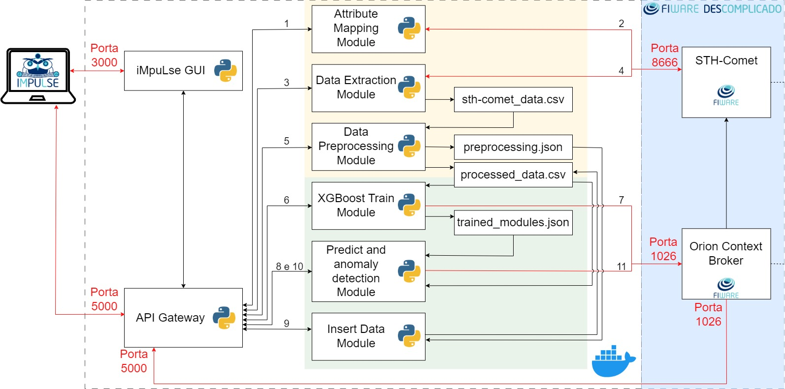

---

## **Visão Geral**

O projeto segue uma arquitetura modular, dividida em:

- **Controllers**: Responsáveis por gerenciar endpoints e conectar-se às camadas de serviço.

- **Services**: Contêm as regras de negócio e lógica de manipulação de dados.

- **Repository**: Gerenciam conexões e operações com APIs externas, como STH-Comet e Orion.

- **Swagger**: Documentação interativa da API, acessível em `/apidocs`.

---

## **Índice**

1. [Recursos Disponíveis](#recursos-disponíveis)

2. [Tecnologias Utilizadas](#tecnologias-utilizadas)

3. [Pré-requisitos](#pré-requisitos)

4. [Como Rodar o Projeto](#como-rodar-o-projeto)
   - [Usando Docker (Recomendado)](#usando-docker-recomendado)
   - [Rodando Localmente (Sem Docker)](#rodando-localmente-sem-docker)

5. [Configurar FIWARE](#configurar-fiware)

6. [Testar o Projeto](#testar-o-projeto)

7. [Contribuição](#contribuição)

8. [Problemas Conhecidos](#problemas-conhecidos)

9. [Licença](#licença)

---

## **Recursos Disponíveis**

1. **Health Check**: Verifica o status do sistema.

2. **Extração de Dados**: Integração com STH-Comet para obter dados históricos.

3. **Pré-processamento**: Normalização e limpeza de dados usando `pandas` e `scipy`.

4. **Mapeamento de Atributos**: Conversão e organização de dados.

5. **Treinamento com XGBoost**: Criação de modelos preditivos baseados em dados extraídos.

6. **Detecção de Anomalias**: Identificação de padrões incomuns.

---

## **Tecnologias Utilizadas**

- **[Python](https://www.python.org/downloads/)**: Linguagem principal para desenvolvimento.

- **[Flask](https://flask.palletsprojects.com/en/latest/)**: Framework para APIs REST.

- **[FIWARE](https://fiware.org/)**: Integração com STH-Comet e Orion Context Broker.

- **[XGBoost](https://xgboost.readthedocs.io/en/stable/)**: Para treinamento e previsão.

- **[Pandas](https://pandas.pydata.org/)**: Manipulação de dados.

- **[Scipy](https://scipy.org/)**: Ferramentas estatísticas.

- **[Swagger](https://swagger.io/)**: Documentação interativa.

---

## **Pré-requisitos**

1. **[Docker](https://www.docker.com/products/docker-desktop)** instalado no sistema.

2. **[Git](https://git-scm.com/downloads)** para clonar o repositório.

3. **[Python 3.10+](https://www.python.org/downloads/)** (se não estiver usando Docker diretamente).

4. Ferramentas para configurar FIWARE, como:
   - **[STH-Comet](https://fiware-sth-comet.readthedocs.io/en/latest/)**.
   - **[Orion Context Broker](https://fiware-orion.readthedocs.io/en/latest/)**.

---

## **Como Rodar o Projeto**

### **Usando Docker (Recomendado)**

1. Certifique-se de que o **[Docker Desktop](https://www.docker.com/products/docker-desktop)** está em execução.

2. Construa a imagem Docker utilizando o código abaixo:
   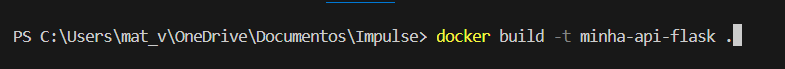

3. Agora rode o comando abaixo no prompt de sua máquina para abrir a API:
   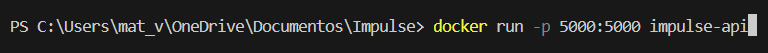

### **Rodando Localmente (Sem Docker)**

1. Instale o Python 3.10+ e crie um ambiente virtual:
   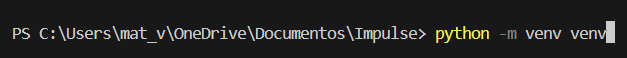
   
2. Ative o ambiente virtual:

No Windows
  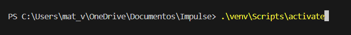

No Linux
  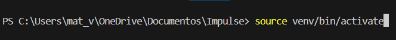

3. Instale as dependências necessárias:
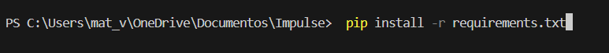

4. Execute o servidor Flask:
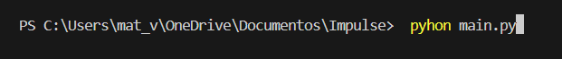

5. Acesse a API em http://localhost:5000/apidocs.

---

## **Configurar FIWARE**

Certifique-se de que as variáveis no arquivo `src/config.json` estão configuradas corretamente para apontar para os serviços STH-Comet e Orion Context Broker. Exemplo de configuração:

   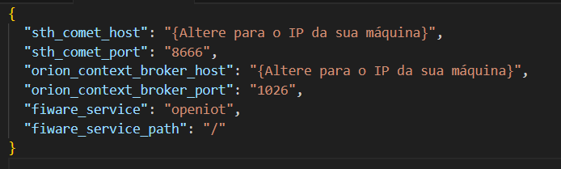

### **Campos**

- **sth_comet_host**: IP ou hostname do serviço STH-Comet.

- **sth_comet_port**: Porta onde o STH-Comet está rodando.

- **orion_context_broker_host**: IP ou hostname do Orion Context Broker.

- **orion_context_broker_port**: Porta onde o Orion Context Broker está rodando.

- **fiware_service**: Nome do serviço FIWARE.

- **fiware_service_path**: Caminho do serviço FIWARE.

---

## **Testar o Projeto**

1. Acesse o **[Swagger UI](http://localhost:5000/apidocs)**.

2. Explore ost endpoints disponíveis:

   - **/health-check**: Verifica o status do sistema.

   - **/data-extraction**: Realiza a extração de dados históricos do STH-Comet.

   - **/preprocess-data**: Realiza o pré-processamento dos dados extraídos.

   - **/attribute-mapping**: Mapeia os atributos dos dados recebidos.

   - **/xgboost-train**: Treina um modelo XGBoost para predição.

   - **/anomaly-detection**: Detecta anomalias nos dados.

---

## **Contribuição**

Se você deseja contribuir para o projeto, siga os passos abaixo:

1. Clone o repositório em sua maquina.

2. Crie uma nova branch para suas alterações:
   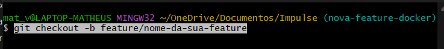

3. Faça suas alterações e commit:
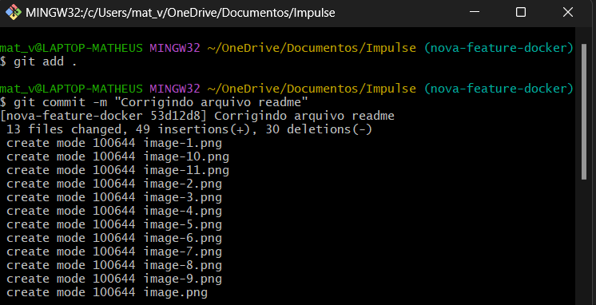

4. Envie as alterações por push para o repositorio:
   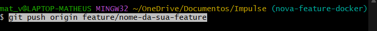

5. Abra um pull request no repositório original.

---

## **Problemas Conhecidos**

- **Arquivos Grandes**: Certifique-se de que a pasta `venv/` está no `.gitignore` para evitar push de arquivos grandes para o repositório.

- **Configuração do FIWARE**: Caso os serviços STH-Comet ou Orion não estejam corretamente configurados no arquivo `config.json`, a API poderá falhar em conexões ou retornos.

---

## **Licença**

Este projeto está licenciado sob a [MIT License](LICENSE).

Se precisar de ajuda, abra uma issue no GitHub ou entre em contato com o responsável pelo projeto.

